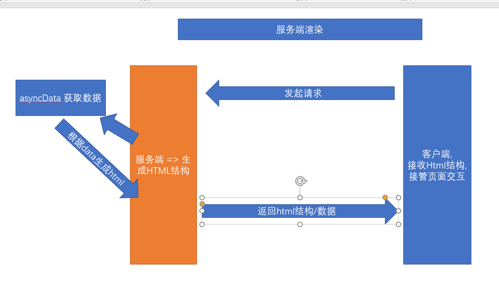

##  CSR演示和特点 - 客户端渲染

> 什么是CSR ?  同学们:其实这种类似字母的堆积都是 单词的缩写拼接

**`Client Side Render`** , 也就是在客户端渲染,我们请求的Html页面中并没有核心内容,而是需要下载执行 js 文件，由浏览器动态生成页面，并通过 JS 进行页面交互事件与状态管理

简单一句话 : **`页面的主体结构是请求完js,由js完成的渲染`**

> 客户端渲染的优势是什么?

 适合前后端分离开发，方便维护，单页应用中几乎都是客户端渲染,像我们的黑马头条 都是客户端渲染

> 缺点呢? 难道没缺点?

**`首次加载慢`，`不利于 SEO`** , 因为我们的大部分动态结构 都是在客户端渲染的,后端返回的只是一个空的div,

因为首次加载需要先把js加载完毕,然后才能去渲染

SEO => 搜索引擎优化 => H5页面 => 百度/头条 => 爬虫爬取网页的结构./关键词/语义化标签

> 上述的效果可通过查看 黑马头条的网页元素进行验证

## SSR渲染的演示和特点-服务端渲染

> 什么是SSR ? 和 CSR一个字之差! SSR其实就是 把Client换成了Server, 客户端渲染变成了服务端渲染

**`Server Side Render`** (服务端渲染 **SSR**)：服务器直接**`生成 HTML 文档结构`** 返回给浏览器，但页面交互能力有限。适合于任何后端语言：PHP、Java、Python、Go, ASP 等。aspx => 很多服务器标签

相当于 在服务端完成了页面的结构的生成 => 返回生成好的页面结构 =>不需要js请求完毕就有内容

> 服务端渲染 的优势是什么?

响应速度快(首屏渲染速度快)，有利于 SEO

> 劣势 ?

* 前后端代码混合在一起，难以开发和维护，不适合进行前后端分离开发

前后一体 =>  前后分离 => 服务端渲染  =>     中间件(只做服务端渲染)  =>  服务端(主)

>服务端页面返回的内容直接是Html文档结构,不用等到下载完js,再通过js去渲染

## Vue的SSR介绍及示例演示

> Vue的SSR(服务端渲染)是什么?

Vue.js 是构建客户端应用程序的框架。默认情况下，可以在浏览器中输出 Vue 组件，进行生成 DOM 和操作 DOM。然而，也可以将同一个组件渲染为**`服务器端的 HTML 字符串`**，将它们直接发送到浏览器，最后将这些静态标记"激活"为客户端上完全可交互的应用程序。

[Vue的SSR文档](https://ssr.vuejs.org/zh/) 

**`Vue的SSR代码既包含客户端部分,又包含服务端部分`** 

基于react、vue框架，客户端渲染和服务器端渲染的结合，在服务器端执行一次，用于实现服务器端渲染（首屏直出），在客户端再执行一次，用于**`接管页面交互`**，核心解决SEO和首屏渲染慢的问题。

> 上面这段话的意思是, 在服务端 生成页面结构, 页面结构返回给了客户端浏览器, 然后下载运行js, js同样也会执行,但是并不会再次执行渲染,而是直接接管了页面的交互, 比如点击事件.业务操作

接下来,我们运行一个官方的小例子看看效果

> 首先,我们需要新建一个文件夹  ssrDemo, 并在该目录下初始化 npm

```bash
$ npm init -y 
```

> 然后,我们来安装 Vue 和 Vue 服务端渲染包

```bash
$ npm  install vue vue-server-renderer --save
```

> 然后 在该目录下 新建一个 app.js,内容如下

```js
// 第 1 步：创建一个 Vue 实例
const Vue = require('vue')
const app = new Vue({
  template: `<div>Hello World</div>`
})

// 第 2 步：创建一个 renderer
const renderer = require('vue-server-renderer').createRenderer()

// 第 3 步：将 Vue 实例渲染为 HTML renderToString 返回一个promise
renderer.renderToString(app).then(html => {
  console.log(html)
}).catch(err => {
  console.error(err)
})
```

> 我们可以直接用命令执行 看看能输出什么内容

```bash
$ node app
```


>试着写一些动态内容

```js
// 第 1 步：创建一个 Vue 实例
const Vue = require('vue')
const app = new Vue({
  template: `<div>Hello World {{ name }}</div>`,
  data : {
      name: '张三'
  }
})

// 第 2 步：创建一个 renderer
const renderer = require('vue-server-renderer').createRenderer()

// 第 3 步：将 Vue 实例渲染为 HTML renderToString 返回一个promise
renderer.renderToString(app).then(html => {
  console.log(html)
}).catch(err => {
  console.error(err)
})
```


> 我们发现代码动态数据直接渲染成了真正的字符串

OK, 既然可以生成最终的页面字符串, 我们可以和express进行结合,写一个最终版的服务端渲染示例

> 首先安装express

```bash
$ npm  i express
```

> 然后新建 server.js , 将 app.js  的数据进行返回

首先,将app.js的内容导出

```js
// 第 1 步：创建一个 Vue 实例
const Vue = require('vue')
const app = new Vue({
  template: `<div>Hello World {{ name }}</div>`,
  data : {
      name: '张三'
  }
})

// 第 2 步：创建一个 renderer
const renderer = require('vue-server-renderer').createRenderer()

// 第 3 步：将 Vue 实例渲染为 HTML renderToString 返回一个promise
// renderer.renderToString(app).then(html => {
//   console.log(html)
// }).catch(err => {
//   console.error(err)
// })
module.exports = renderer.renderToString(app) // 直接导出一个对象
```

然后,在server.js 中通过express 开启服务端口监视,并将导出的模板字符串 进行返回,代码如下

```js
var app = require('express')()
var Hello = require('./app') // 引入app组件
app.get('/', function (req, res) {
    Hello.then(html => {
        res.send(`
        <!DOCTYPE html>
        <html lang="en">
          <head><title>Hello</title></head>
          <body>${html}</body>
        </html>
        `)
    })
  
})
app.listen(10086, function(){
    console.log('服务端渲染项目启动,访问地址在 http://localhost:10086/')
})
```

OK了, 访问对应的地址 ,通过审查元素,我们发现返回的页面直接是已经组装好的页面结构,

同志们! 这就是**`纯服务端渲染`**

## Nuxt介绍

> 上个小节中,我们的服务端内容觉得还好啊,不难啊,挺好用啊 , **`But`**!真实的案例往往超乎你的想象,
>
> 我们并不可能只返回一个字符串,然后没有任何交互, 交互只能在客户端做啊!

服务端渲染=> 解决首屏渲染问题,SEO不够友好

怎么办? 我们并不是只有服务端内容, 不能为了解决这个问题,把交互给丢了

> 所以在既有服务端,又有客户端的情况下,我们的代码好像并不能用了
>
> 此时 带来第三方基于Vue的服务端渲染框架Nuxt

需要大家注意的是:

[说明](https://zh.nuxtjs.org/guide) 

1. Nuxt**`不是`**Vue官方提供的
2. Nuxt是**`基于Vue`**的服务端渲染的框架
3. Nuxt.js 预设了利用 Vue.js 开发**`服务端渲染`**的应用所需要的各种配置。

> nuxt有什么作用?

基于 Vue、Webpack 和 Babel Nuxt.js 集成了以下组件/框架，用于开发完整而强大的 Web 应用：

1. [Vue 2](https://github.com/vuejs/vue)
2. [Vue-Router](https://github.com/vuejs/vue-router)
3. [Vuex](https://github.com/vuejs/vuex) (当配置了 [Vuex 状态树配置项](https://zh.nuxtjs.org/guide/vuex-store) 时才会引入)
4. [Vue 服务器端渲染](https://ssr.vuejs.org/en/) (排除使用 [`mode: 'spa'`](https://zh.nuxtjs.org/api/configuration-mode))
5. [Vue-Meta](https://github.com/nuxt/vue-meta)

>看到了没? 

Nuxt里面拥有我们开发纯前端项目的一切配置,用于开发完整强大的web应用

我们用了nuxt,我们的项目就不再是一个纯前端项目了, 而是一个包含**`服务端渲染`**的前后端项目

服务端 + 客户端  => nuxt项目 ,并不会丢弃我们原来的前端内容

只不过 **`把每个组件的首屏渲染放在了 服务端 而不是客户端`**

## Nuxt创建项目

> 说了这么半天, Nuxt怎么用, 我们怎么用它开发项目?

来做个例子看看吧

> 首先我们来新建个文件夹  nuxtDemo  初始化 npm

```bash
$ npm init -y 
```

> 然后在package.json中配置 一个 调试启动命令,启动命令是nuxt

```js
{
  "name": "nuxtDemo",
  "version": "1.0.0",
  "description": "",
  "main": "index.js",
  "scripts": {
     "dev": "nuxt"
  },
  "keywords": [],
  "author": "",
  "license": "ISC"
}

```

> 安装 nuxt依赖包,这是 服务端渲染的关键

```bash
$ npm i nuxt --save
```

> 在根目录下 新建 **`pages`**, 特别注意: 这里 只能叫**`pages`**,不能起别的名字

在 pages新建一个组件 home.vue,内容如下

```vue
<template>
  <div class='app'>
      <div class="header">水若寒宇</div>
      <div class="body">
           <div class='item' v-for="item in 30" :key="item">
               <span>刘备</span>
               <span>{{ new Date().toDateString() }}</span>

           </div>
      </div>
  </div>
</template>

<script>
export default {
  
}
</script>

<style>
  .header {
         height: 50px;
         background-color: aquamarine;
         text-align: center;
         font-size: 20px;
         line-height: 50px;
  }
.item {
     display: flex;
    justify-content: space-between;
    padding: 0px 10px;
    height: 40px;
    line-height: 40px;
   }
    span:nth-child(2) {
        font-size: 14px;
        color:#ccc;
}
</style>
```

> 组件建立好之后, 运行nuxt项目

```bash
$ npm run dev
```

项目启动成功,我们访问对应的端口,一个nuxt的项目被创建好了

>我们会发现,在项目中多了一个.nuxt文件夹, 这个文件夹 是  编译客户端和服务端代码的结果

我们pages下的home组件会自动帮我们生成 对应的路由的下的组件, 

而且pages新建组件 也会完成路由的新建和自动重启

>以后百分之九十 还是 Vue的spa项目
>
>vue-cli 做的前后分离项目  => 纯客户端渲染
>
>Nuxt并不是官方的   => 解决首屏渲染慢的问题 => 一般只会做一个页面
>
>双11 => 大流量访问页面的时候 => 首页做成服务端渲染项目

## Nuxt路由的动态路由

> Nuxt会帮我们生成对应的路由,但是 我们之前学过 动态路由怎么办

* 动态路由

> 原来在 单页spa项目中,我们需要给 路由规则一个 参数  { path: '/user/:id'  }, 
>
> 然后传递一个 通过 /user/123 来传递参数

在nuxt中怎么实现呢 

nuxt项目中 标签跳转, 直接用nuxt-link标签, 相当于原来的router-link

```vue
<nuxt-link to="/home">主页</nuxt-link>
```

nuxt-link标签只能在nuxt项目中使用,不能在原来的vue-cli项目中使用

 [Nuxt路由](https://zh.nuxtjs.org/guide/routing)

在 Nuxt.js 里面定义带参数的动态路由，需要创建对应的**`以下划线作为前缀`**的 Vue 文件 或 目录。

> 假如你想 实现  /users/:id 的动态路由,你需要建立一个users文件夹, 然后 在该文件夹下
>
> 创建一个以下划线为前缀的文件 _id.vue

以下目录结构：

```
pages/
--| users/
-----| _id.vue
```

Nuxt.js 生成对应的路由配置表为：

```
router: {
  routes: [
    {
      name: 'users-id',
      path: '/users/:id?',
      component: 'pages/users/_id.vue'
    }]
}
```

你会发现名称为 `users-id` 的路由路径带有 `:id?` 参数，表示该路由是可选的。如果你想将它设置为必选的路由，需要在 `users/_id` 目录内创建一个 `index.vue` 文件。

> 我们可以尝试一下

## Nuxt的asyncData 和生命周期

> Nuxt.js 扩展了 Vue.js，增加了一个叫 `asyncData` 的方法，使得我们可以在设置组件的数据之前能异步获取或处理数据。

Vue.js =>  实例创建前后  /  页面渲染前后 /  数据更新前后 / 组件卸载前后

Nuxt.js  =>  asyncData事件  => 会在服务端渲染初始化的时候 调用

`asyncData`方法会在组件（**`限于页面组件,在pages下的组件`**）**`每次加载之前`**被调用。它可以在服务端或路由更新之前被调用。 在这个方法被调用的时候，第一个参数被设定为当前页面的[上下文对象](https://zh.nuxtjs.org/api#上下文对象)，你可以利用 `asyncData`方法来获取数据，Nuxt.js 会将 `asyncData` 返回的数据融合组件 `data` 方法返回的数据一并返回给当前组件。



**`注意`**：由于`asyncData`方法是在组件 **`初始化前`** 被调用的，所以在方法内是没有办法通过 `this` 来引用组件的实例对象。  这个asyncData方法 是相当于在后端调用发起了请求,并将数据和data中的数据进行了融合, 这些数据会返回前端,**`交接`**给前端的交互

asyncData 函数 需要返回一个对象,返回的对象会和Vue中的对象进行融合,合并

> asyncData中不能用this !

[asyncData说明文档](https://zh.nuxtjs.org/guide/async-data) 

> 尝试做个例子吧! 这里提供一个获取数据的接口, 我们可以在asyncData中 尝试请求,并进行服务端数据的渲染

[黑马头条的频道接口](http://ttapi.research.itcast.cn/mp/v1_0/channels) 

首先,我们得给我们的nuxt项目安装一个请求工具,也就是axios

axios 可以在客户端使用,也可以在nodejs后端使用

```bash
$ npm i axios 
```

然后在pages新建一个 **`asyncList.vue`**组件,内容如下	

```vue
<template>
<!-- 列表    -->
  <div class='async-list'>
      <!-- 后端接口请求的数据 -->
      <!-- v-for是在 服务端执行 还是在客户端执行的 -->
      <div :class="{select: selectId === item.id}" class='item' @click="clickItem(item.id)" v-for="item in list" :key="item.id">{{ item.name }}</div>
  </div>
</template>

<script>
import axios  from 'axios'
export default {
  data () {
        return {
            selectId: null
        }
  },
  methods:{
      clickItem (id) {
          this.selectId = id  // 记录当前谁被选中
      }
  },
    // 执行asyncData的时候 还没有 this  不能给data赋值
  async asyncData () {
   let { data }  =  await axios({
          url: 'http://ttapi.research.itcast.cn/mp/v1_0/channels' // 请求黑马头条的地址
      })
     // this.list = data.data.channels  这种写法是错误的 因为 执行asyncData的时候 组件还没实例化 this是undefined
      return {
       list : data.data.channels  // 返回频道数据 该频道会和 data数据进行合并
      }
   }
}
</script>

<style>
   .item {
       height: 40px;
       line-height: 40px;
       padding: 0 10px;
       text-align: center;
   }
   .select {
       color: red;
       font-weight: bold;
       border: 2px solid red;
   }
</style>
```


> 通过上面的示例,我们可以看出,直接返回的html页面是一个渲染好的页面,但是我们依然从devtools中发现了 list数据,这说明首次渲染,已经将提前在**`服务端将内容渲染好`**, 到达前端之后,前端实现了**`接管`**,

同学们,这就是真正的服务端渲染!

需要注意的是，在任何 Vue 组件的[生命周期](https://vuejs.org/v2/guide/instance.html#Lifecycle-Diagram)内， 只有 `beforeCreate` 和 `created` 这两个方法会在 **客户端和服务端**被调用。其他生命周期函数仅在客户端被调用。

也就是 created会在服务端执行一遍,又会在客户端执行一遍,所以如果我们在created中加载数据, 就会**`重复两次`**,


## 利用Nuxt脚手架开展项目实例

> 上面我们使用nuxt是纯手工创建的, 目的是让大家熟悉,实际上nuxt也有脚手架 帮我们创建项目

怎么玩?

> 首先肯定是先读[文档]([https://zh.nuxtjs.org/guide/installation/#%E6%96%B0%E6%89%8B%E6%A8%A1%E6%9D%BF](https://zh.nuxtjs.org/guide/installation/#新手模板))

首先,nuxt也有脚手架来帮助我们创建一个服务端渲染的项目,so,开整

```bash
$  npx create-nuxt-app  heima # npx是npm自带的一个工具 它每次都会下载最新包   heima 是一个项目名
```

> 然后是一系列的窒息选择操作 , 我们选择   Element(UI框架) +express(web服务框架) + ***`Axios`***(Nuxt模块) +Eslint(语法校验) +SSR(服务端渲染)

上面这些选择是nuxt给我们提供好的选项,创建好之后,我们将切到目录下 运行并且访问项目

```bash
$ yarn dev # 使用yarn 
$ npm run dev # 使用 dev

```

访问 localhost:3000 

## Nuxt脚手架-开发黑马头条PC的登录和数据首页

> 老铁们,这个nuxt已经让我们创建好项目并且启动起来了,我们要做什么呢?

可否还记得大明湖畔做过的黑马头条PC项目 ? 

> 什么 ? 完全没印象 !  

没印象没关系,这里奉上老铁的[git仓库地址](https://github.com/shuiruohanyu/90heimatoutiao)  

> 我们的目的是 平移一两个黑马头条的页面过来

开整

> 首先,先把黑马头条的仓库克隆下来, 由于我们黑马头条使用了elementUI, 所以当初创建nuxt项目,我们也用了elementUI

注意, 原来我们的项目用了less预处理器,但是 nuxt并没有,所以首先给我们的项目增加less 依赖

```bash
$ npm i less less-loader # 安装less 和less-loader
```

> 其次,我们黑马头条用了一些资源图片,把资源图片拷贝到nuxt目录相等位置,这样可以保证代码几乎不用更改任何内容

接下来,我们先平移 登录页面login,直接将login文件夹 拷贝到nuxt项目的pages下

**`login/index.vue`**

```代码
<template>
  <div class="login">
    <!-- 放置一个el-card组件 -->
    <el-card class="login-card">
      <!-- 放置标题图片 -->
      <div class="title">
        
      </div>
      <!-- 放置表单  el-form model  绑定数据对象 -->
      <el-form ref="myForm" :model="loginForm" :rules="loginRules">
        <!-- 表单域 里面  prop要写要检验的字段名  放置 input/select/checkbox 相当于一行-->
        <el-form-item prop="mobile">
          <el-input v-model="loginForm.mobile" placeholder="请输入手机号" />
        </el-form-item>
        <!-- 表单域 -->
        <el-form-item prop="code">
          <el-input v-model="loginForm.code" style="width:65%" placeholder="验证码" />
          <el-button style="float:right" plain>
            发送验证码
          </el-button>
        </el-form-item>
        <el-form-item prop="check">
          <!-- 复选框 -->
          <el-checkbox v-model="loginForm.check">
            我已阅读并同意用户协议和隐私条款
          </el-checkbox>
        </el-form-item>
        <el-form-item>
          <el-button type="primary" style="width:100%" @click="submitLogin">
            登录
          </el-button>
        </el-form-item>
      </el-form>
    </el-card>
  </div>
</template>

<script>
export default {
  data () {
    return {
      loginForm: {
        mobile: '', // 手机号
        code: '', // 验证码
        check: false // 是否勾选 同意被坑
      },
      loginRules: {
        // 验证规则对象 key(字段名):value(规则 => [])
        mobile: [{ required: true, message: '请输入您的手机号' }, {
          pattern: /^1[3456789]\d{9}$/, message: '手机号格式不正确'
        }],
        code: [{ required: true, message: '请输入你的验证码' }, {
          pattern: /^\d{6}$/, message: '验证码格式不正确'
        }],
        check: [{
          validator (rule, value, callback) {
          // 自定义校验函数
          // rule 规则 没啥用
          // value 要校验的字段的值
          // callback 是一个回调函数
            if (value) {
            // 认为已经勾选
              callback() // 认为当前的规则校验通过了
            } else {
            // 认为没有勾选
              callback(new Error('您应该同意我们的霸王条款,让我们欺负你')) // 如果没有勾选 认为当前校验失败 应该停止
            }
          }
        }]

      }
    }
  },
  methods: {
    submitLogin () {
    //  手动校验
      this.$refs.myForm.validate((isOK) => {
        if (isOK) {
          //  说明校验通过  应该调用登录接口
          // axios  body参数 get参数地址参数 路由参数  查询参数
          // body参数 axios  data
          // get参数  axios params
          this.$axios({
            url: '/authorizations', // 请求地址 axios 没有指定 类型 默认走get类型
            method: 'post', // 类型
            data: this.loginForm // body 参数
          }).then((result) => {
            // 只接受正确结果
            // 前端缓存 登录成功返回给我们的令牌
            window.localStorage.setItem('user-token', result.data.token)
            this.$router.push('/home') // 跳转到home页
          })
        }
      })
    }
  }
}
</script>

<style lang='less' scoped>
  .login  {
    background-image: url('../../assets/img/back.jpg');
    height: 100vh;
    background-size: cover;
    display: flex;
    justify-content: center;
    align-items: center;
    .login-card {
      width: 440px;
      height: 350px;
      .title {
        text-align: center;
        margin-bottom: 30px;
        img {
          height: 45px;
        }
      }
    }
  }
</style>

```

> 拷贝过去之后,我们访问 localhost:3000/login ,我们发现一切OK, 页面没有任何问题,**`真是nice`**!

并且,我们之前做的很多校验,正则都能正常之前,这是因为服务端首屏渲染, 内容和逻辑被客户端**`正常接管`**,

除了首屏在服务端完成,一切都还和原来一样!

创建项目的时候,选了axios模块, 这个axios模块实际上赋值了Vue的全局对象 名字就叫 $axios

**`this.$axios => 直接获取的就是 创建项目时 所选择的axios`**

> 但是这里有个问题,就是我们的axios,请求 的baseUrl没有设置 ,在哪里设置呢? 

找到nuxt.config.js文件 

设置 axios 属性的baseUrl即可,**`注意`**  改完这个配置需要重新启动

```js
axios: {
    baseURL: 'http://ttapi.research.itcast.cn/mp/v1_0/'
  },
```

> 点击登录成功,我们会进入home组件 

老高带你做一个新的home组件, 展示实时的疫情数据, 小递归 ,树形 

```vue
<template>
  <el-card>
    <!-- 卡片组件 -->
    <!-- 绑定数据 -->
    <el-table :data="list" row-key="id">
      <el-table-column prop="name" label="地域名称" />
      <el-table-column label="确认总人数(人)" prop="total.confirm" />
      <el-table-column label="疑似总人数(人)" prop="total.suspect" />
      <el-table-column label="死亡总人数(人)" prop="total.dead" />
      <el-table-column label="康复总人数(人)" prop="total.heal" />
    </el-table>
  </el-card>
</template>

<script>
// https://view.inews.qq.com/g2/getOnsInfo?name=disease_h5  获取数据的接口
// jsonp 只在前端用 => 同源策略
export default {
  // 执行asyncData的时候 是在服务端
  async asyncData (context) {
    //  axios来请求数据
    // 这里不能用this
    const { data: { data } } = await context.app.$axios({
      url: 'https://view.inews.qq.com/g2/getOnsInfo?name=disease_h5' // 实时疫情
    })
    const result = JSON.parse(data)
    // 要给所有的数据生成一个唯一键 递归
    // 递归处理所有的数据 给所有的数据加上一个id  前缀的目的是让每条数据的id都不一样
    const dealID = function (arr, prefix) {
      arr.forEach((city, index) => {
        city.id = prefix + '-' + (index + 1) // 给每个城市赋值一个id
        if (city.children) {
          // 如果有children 要给children继续加id
          // 递归 自身调用自身
          dealID(city.children, city.id) // 湖北 id 1 =>  1 => 1-1  // 浙江 2  2-1
        }
      })
    }
    dealID(result.areaTree, '') // 递归给所有的数据添加一个1
    return { list: result.areaTree } // return的数据会和 data的中数据进行融合
  }

}
</script>

<style>

</style>

```


时间关系,我们对nuxt只是简单进行了一下了解,实际上还有内容可以做,希望大家通过通过[nuxt官网](https://zh.nuxtjs.org/guide/installation)来认识更多的功能

# `That 's All`   `谢幕`  